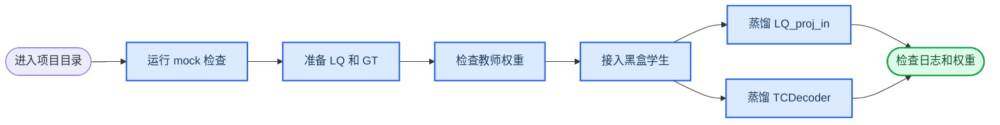

# FlashVSR `LQ_proj_in` 与 `TCDecoder` 蒸馏教程

_Linux 分步操作手册 · 使用仓库内置 snapshot adapter · 最后核对日期：2026-08-19_

---

## 📋 你最终会得到什么

本教程从“已经进入项目目录、Python 环境已经可用”开始，不重复 Linux、CUDA、PyTorch 和虚拟环境的安装。

完成后会得到两个相互独立的训练目录：

```text
$HOME/dit_codec/runs/flashvsr_lq_proj/
$HOME/dit_codec/runs/flashvsr_tcdecoder/
```

第一个目录保存 `LQ_proj_in -> student_condition_encoder` 的蒸馏结果；第二个目录保存 `TCDecoder -> conditional_student_decoder` 的蒸馏结果。每个目录都有 JSONL 日志、训练 checkpoint、验证图，以及可选的 TensorBoard 日志。



> **重要：** 这两个任务不运行、不训练 DiT。`LQ_proj_in` 蒸馏学习条件特征；`TCDecoder` 蒸馏使用冻结的 Wan Encoder 生成主 latent，再让教师和学生分别解码。

## ✅ 第 0 步：确认你在仓库根目录

执行：

```bash
pwd
test -f pyproject.toml
test -f configs/teachers/flashvsr_snapshot.yaml
test -f configs/teachers/wan_snapshot.yaml
python -m distill_codec.cli --help
```

预期输出的最后部分应包含三个命令：

```text
{make-mock-data,probe,train}
```

如何判断成功：

- 四条命令的退出码都是 `0`
- 当前目录下存在 `pyproject.toml`
- CLI 帮助中存在 `probe` 和 `train`

如果 `python -m distill_codec.cli` 报找不到模块，说明当前 Python 环境还没有安装本项目，或者没有在仓库根目录执行。

## 🧪 第 1 步：先跑一次 mock 链路

这一步不需要真实权重，也不使用你的黑盒网络。它只确认数据读取、forward、loss、backward、验证图、checkpoint 和 resume 链路可运行。

### 1.1 生成 mock 配对图片

执行：

```bash
python -m distill_codec.cli make-mock-data \
  --output work/tutorial_mock_data \
  --count 8 \
  --size 64
```

预期输出类似：

```json
{"gt_root": "work/tutorial_mock_data/gt", "lq_root": "work/tutorial_mock_data/lq"}
```

检查生成结果：

```bash
find work/tutorial_mock_data -type f -name '*.png' | sort | head
find work/tutorial_mock_data/lq -type f -name '*.png' | wc -l
find work/tutorial_mock_data/gt -type f -name '*.png' | wc -l
```

预期两个计数都是：

```text
8
```

### 1.2 Probe `LQ_proj_in` mock 配置

执行：

```bash
python -m distill_codec.cli probe \
  --config configs/smoke/flashvsr_lq_proj.yaml \
  --set "data.lq_root=work/tutorial_mock_data/lq" \
  --set "data.gt_root=work/tutorial_mock_data/gt" \
  --set "trainer.device=cpu"
```

预期输出是一行 JSON，结构类似：

```json
{
  "device": "cpu",
  "losses": {
    "condition": 0.123,
    "condition_cos": 0.456,
    "condition_stat": 0.078
  },
  "preflight": {
    "pair_count": 8,
    "lq_sizes": [[64, 64]],
    "gt_sizes": [[64, 64]]
  },
  "recipe": "flashvsr_lq_proj_distill",
  "total_loss": 0.657,
  "trainable_parameters": 12345
}
```

这里的 loss 和参数量仅为格式示意，实际数值不要求相同。

如何判断成功：

- `recipe` 等于 `flashvsr_lq_proj_distill`
- `pair_count` 等于 `8`
- `total_loss` 是有限数字，不是 `NaN` 或 `Infinity`
- `trainable_parameters` 大于 `0`

### 1.3 跑完整 mock smoke

执行：

```bash
PYTHON_BIN="$(command -v python)" \
  ./scripts/run_smoke.sh work/tutorial_smoke
```

这个脚本会运行七种 recipe。每个 recipe 先训练到 step 1，再从 checkpoint 恢复到 step 2。

检查结果：

```bash
find work/tutorial_smoke/runs -name 'step_*.pt' | sort
find work/tutorial_smoke/runs -name 'metrics.jsonl' | sort
find work/tutorial_smoke/runs -name 'step_*.png' | sort
```

如何判断成功：命令最终退出码为 `0`，并且每个 smoke 目录都有 checkpoint 和 `metrics.jsonl`。如果 mock 都不能通过，不要立刻启动真实权重训练。

## 🖼️ 第 2 步：准备真实 PNG 数据

LQ 和 GT 都由工程作为 RGB 图片读取。PNG、JPG、JPEG、BMP、WebP、TIFF 都支持；推荐使用 PNG 避免额外有损压缩。

目录示例：

```text
$HOME/dit_codec/LQ/scene_01/000001.png
$HOME/dit_codec/LQ/scene_01/000002.png
$HOME/dit_codec/GT/scene_01/000001.png
$HOME/dit_codec/GT/scene_01/000002.png
```

LQ 和 GT 根目录下面的相对路径必须完全一致。下面两条命令应输出相同内容：

```bash
(cd "$HOME/dit_codec/LQ" && find . -type f | sort) > /tmp/lq_files.txt
(cd "$HOME/dit_codec/GT" && find . -type f | sort) > /tmp/gt_files.txt
diff -u /tmp/lq_files.txt /tmp/gt_files.txt
```

预期输出：没有任何内容，退出码为 `0`。

当前教程 YAML 默认：

```yaml
lq_size: [256, 256]
gt_size: [256, 256]
```

启用本教程后面的配对增强时，这两个值表示裁切后的训练 patch 尺寸，不再要求源图严格等于 `256x256`。每对 LQ/GT 源图必须同尺寸：任一边小于目标尺寸会立即报错，大于目标尺寸会在训练时随机裁切。数据集不会替你随机生成退化 LQ。

先用 mock 模型检查真实数据目录：

```bash
python -m distill_codec.cli probe \
  --config configs/smoke/flashvsr_lq_proj.yaml \
  --set "data.lq_root=$HOME/dit_codec/LQ" \
  --set "data.gt_root=$HOME/dit_codec/GT" \
  --set "data.lq_size=[256,256]" \
  --set "data.gt_size=[256,256]" \
  --set "data.augmentation.enabled=true" \
  --set "data.augmentation.shared_across_batch=true" \
  --set "data.augmentation.crop.enabled=true" \
  --set "data.augmentation.crop.mode=random" \
  --set "trainer.device=cpu"
```

如何判断成功：输出 JSON 的 `preflight.pair_count` 等于你的图片对数；`lq_sizes` 和 `gt_sizes` 显示源图实际尺寸，输出 image shape 则是裁切后的 `[B,3,256,256]`。`probe` 固定使用 center crop，不会随机旋转或平移。

## 📦 第 3 步：准备教师权重

snapshot 主线需要三个教师文件：

```text
$HOME/dit_codec/weights/Wan2.1_VAE.pth
$HOME/dit_codec/weights/LQ_proj_in.ckpt
$HOME/dit_codec/weights/TCDecoder.ckpt
```

检查文件是否存在：

```bash
WEIGHT_DIR="$HOME/dit_codec/weights"

for name in Wan2.1_VAE.pth LQ_proj_in.ckpt TCDecoder.ckpt; do
  test -f "$WEIGHT_DIR/$name" || {
    echo "missing: $WEIGHT_DIR/$name"
    exit 1
  }
done

du -h "$WEIGHT_DIR/Wan2.1_VAE.pth" \
  "$WEIGHT_DIR/LQ_proj_in.ckpt" \
  "$WEIGHT_DIR/TCDecoder.ckpt"
```

如尚未下载，可执行：

```bash
WEIGHT_DIR="${WEIGHT_DIR:-$HOME/dit_codec/weights}"
DOWNLOAD_BASE="https://hf-mirror.com/JunhaoZhuang/FlashVSR-v1.1/resolve/main"

mkdir -p "$WEIGHT_DIR"
for name in Wan2.1_VAE.pth LQ_proj_in.ckpt TCDecoder.ckpt; do
  curl --fail --location --retry 5 --retry-delay 3 \
    --continue-at - \
    --output "$WEIGHT_DIR/$name" \
    "$DOWNLOAD_BASE/$name"
done
```

校验 SHA-256：

```bash
cd "$WEIGHT_DIR"
printf '%s\n' \
  '38071ab59bd94681c686fa51d75a1968f64e470262043be31f7a094e442fd981  Wan2.1_VAE.pth' \
  'd6d011cdaaba6a52645086caa08fa04124e746f6ca568140a24007591142bfd2  LQ_proj_in.ckpt' \
  'e224bdcf2f52745cbf4d393ff5374c2ba09e90285d5d19062d2bf63b915b6161  TCDecoder.ckpt' \
  | sha256sum -c -
cd - >/dev/null
```

预期输出：

```text
Wan2.1_VAE.pth: OK
LQ_proj_in.ckpt: OK
TCDecoder.ckpt: OK
```

同时确认仓库内 snapshot 源文件存在：

```bash
test -f third_party/wan/wan_video_vae.py
test -f third_party/flashvsr/utils.py
test -f third_party/flashvsr/TCDecoder.py
```

## 🔌 第 4 步：接入你的黑盒学生网络

假设你的加密 Python 包可以被当前 Python 环境导入，例如：

```text
my_encrypted_package.models:create_condition_encoder
my_encrypted_package.models:create_conditional_decoder
```

冒号左边是模块路径，右边是 factory 函数名。

### 4.1 `LQ_proj_in` 学生接口

```python
import torch


def create_condition_encoder(**kwargs) -> torch.nn.Module:
    return encrypted_condition_encoder
```

Adapter 实际调用过程是：

```text
LQ RGB [B,3,H,W]
  -> 重复为 5 帧 [B,3,5,H,W]
  -> student_condition_encoder
  -> BNC 特征，最后一维为 1536
```

你的模块可以直接返回 tensor，也可以返回只包含 tensor 的字典或 tuple/list。学生返回的 key、数量和每个 tensor shape 必须与教师一致。

### 4.2 条件 `TCDecoder` 学生接口

```python
import torch


class MyConditionalDecoder(torch.nn.Module):
    def forward(
        self,
        latent: torch.Tensor,
        condition_rgb: torch.Tensor,
    ) -> torch.Tensor:
        # latent: Wan 主 latent，例如 [B,16,H/8,W/8]
        # condition_rgb: 已对齐到 GT 尺寸的 LQ RGB [B,3,H,W]
        # 返回 sparse YUV [B,3,H,W]
        return encrypted_decoder(latent, condition_rgb)


def create_conditional_decoder(**kwargs) -> torch.nn.Module:
    return MyConditionalDecoder()
```

对于 `output_mode: sparse_yuv`，输出三个通道分别为 Y、U、V。Adapter 读取 U/V 的 `[0::2, 0::2]` 位置并上采样，再转换成 RGB 计算 loss。

先确认 factory 可以导入并返回 `nn.Module`：

```bash
python - <<'PY'
from distill_codec.factories import import_object

for path in (
    "my_encrypted_package.models:create_condition_encoder",
    "my_encrypted_package.models:create_conditional_decoder",
):
    factory = import_object(path)
    model = factory()
    print(path, type(model).__name__)
PY
```

预期输出类似：

```text
my_encrypted_package.models:create_condition_encoder MyConditionEncoder
my_encrypted_package.models:create_conditional_decoder MyConditionalDecoder
```

如果你的 factory 内部已经自行加载私有格式权重，YAML 中不要再写组件级 `checkpoint`。如果使用普通 PyTorch state dict，可以在组件上设置 `checkpoint`；框架会在 factory 构造模块后调用 `load_state_dict`。

## ⚙️ 第 5 步：创建 `LQ_proj_in` 蒸馏配置

先创建本地配置目录：

```bash
mkdir -p configs/local
```

### `configs/local/flashvsr_lq_proj.yaml`

创建文件并写入以下完整内容：

```yaml
includes:
  - ../teachers/flashvsr_snapshot.yaml

latent_spec:
  family: wan_vae_v2
  channels: 16
  layout: BCHW
  spatial_downsample: 8
  temporal_downsample: 1
  normalization: wan_vae

color:
  matrix: bt709
  range: full
  packed_order: Y00Y01Y10Y11UV
  chroma_location: top_left
  chroma_upsample: nearest

recipe:
  name: flashvsr_lq_proj_distill
  weights:
    condition: 1.0
    condition_cos: 0.1
    condition_stat: 0.1

components:
  student_condition_encoder:
    backend: external
    factory: my_encrypted_package.models:create_condition_encoder
    checkpoint: null
    kwargs: {}
    adapter:
      kind: condition_encoder
      temporal_frames: 5
      condition_spec:
        family: flashvsr_lq_proj_v1_1
        layout: BNC
        feature_dim: 1536
        source: lq
        consumer: dit
        spatial_downsample: 16
        temporal_downsample: 5

data:
  lq_root: ~/dit_codec/LQ
  gt_root: ~/dit_codec/GT
  lq_size: [256, 256]
  gt_size: [256, 256]
  augmentation:
    enabled: true
    shared_across_batch: true
    crop:
      enabled: true
      mode: random
    rotation:
      enabled: true
      mode: continuous
      probability: 0.3
      degrees: [-5.0, 5.0]
      interpolation: bilinear
      padding_mode: reflection
    translation:
      enabled: true
      probability: 0.3
      max_fraction: [0.05, 0.05]
      padding_mode: reflection

trainer:
  device: cuda
  batch_size: 2
  num_workers: 4
  optimizer: adamw
  learning_rate: 0.0001
  weight_decay: 0.0
  scheduler: none
  gradient_accumulation: 1
  clip_grad_norm: 1.0
  max_steps: 100000
  validate_every: 1000
  checkpoint_every: 1000
  keep_last_checkpoints: 5
  tensorboard: true
  amp: true

run:
  output_dir: ~/dit_codec/runs/flashvsr_lq_proj
  seed: 7
```

把 `factory`、数据路径和尺寸改成你的实际值。`condition_spec` 必须与教师输出契约一致，不要为了适配学生而随意修改 `feature_dim` 或布局。

## 🚀 第 6 步：蒸馏 `LQ_proj_in`

### 6.1 先执行真实 probe

```bash
python -m distill_codec.cli probe \
  --config configs/local/flashvsr_lq_proj.yaml
```

真实 `probe` 会加载 `LQ_proj_in.ckpt`、构造你的学生、扫描全部图片，并执行一次前向。它不是跳过权重加载的纯数据检查。

预期输出结构：

```json
{
  "device": "cuda",
  "losses": {
    "condition": 0.021,
    "condition_cos": 0.381,
    "condition_stat": 0.007
  },
  "metadata": {
    "condition_keys": ["features"]
  },
  "preflight": {
    "pair_count": 1000,
    "lq_sizes": [[256, 256]],
    "gt_sizes": [[256, 256]]
  },
  "recipe": "flashvsr_lq_proj_distill",
  "total_loss": 0.0598,
  "trainable_parameters": 12345678
}
```

如何判断成功：

- `device` 是 `cuda`
- `recipe` 正确
- `condition_keys` 与教师返回一致
- 三项 loss 和 `total_loss` 都是有限值
- 没有 condition shape mismatch

### 6.2 先进行 10 step 小规模试跑

```bash
python -m distill_codec.cli train \
  --config configs/local/flashvsr_lq_proj.yaml \
  --set "trainer.max_steps=10" \
  --set "trainer.validate_every=5" \
  --set "trainer.checkpoint_every=5" \
  --set "run.output_dir=$HOME/dit_codec/runs/flashvsr_lq_proj_trial"
```

训练过程中，当前 CLI 不会每一步都打印 loss。loss 会实时追加到：

```text
$HOME/dit_codec/runs/flashvsr_lq_proj_trial/metrics.jsonl
```

另开一个终端观察：

```bash
tail -f "$HOME/dit_codec/runs/flashvsr_lq_proj_trial/metrics.jsonl"
```

日志行示意：

```json
{"global_step": 1, "loss/condition": 0.021, "loss/condition_cos": 0.381, "loss/condition_stat": 0.007, "phase": "train", "total_loss": 0.0598}
```

训练结束时终端输出类似：

```json
{"checkpoint": "/home/user/dit_codec/runs/flashvsr_lq_proj_trial/checkpoints/step_00000010.pt", "global_step": 10, "output_dir": "/home/user/dit_codec/runs/flashvsr_lq_proj_trial", "start_step": 0}
```

检查产物：

```bash
find "$HOME/dit_codec/runs/flashvsr_lq_proj_trial" -maxdepth 2 -type f | sort
```

应该看到：

```text
metrics.jsonl
checkpoints/step_00000005.pt
checkpoints/step_00000010.pt
validation/step_00000005.png
validation/step_00000010.png
tensorboard/events.out.tfevents.*
```

### 6.3 启动正式训练

试跑正常后执行：

```bash
python -m distill_codec.cli train \
  --config configs/local/flashvsr_lq_proj.yaml
```

默认输出到：

```text
$HOME/dit_codec/runs/flashvsr_lq_proj/
```

## ⚙️ 第 7 步：创建条件 `TCDecoder` 蒸馏配置

### `configs/local/flashvsr_tcdecoder.yaml`

创建文件并写入：

```yaml
includes:
  - ../teachers/wan_snapshot.yaml
  - ../teachers/flashvsr_snapshot.yaml
  - ../students/private_blackbox.yaml

latent_spec:
  family: wan_vae_v2
  channels: 16
  layout: BCHW
  spatial_downsample: 8
  temporal_downsample: 1
  normalization: wan_vae

color:
  matrix: bt709
  range: full
  packed_order: Y00Y01Y10Y11UV
  chroma_location: top_left
  chroma_upsample: nearest

recipe:
  name: flashvsr_decoder_conditional_student
  weights:
    teacher: 1.0
    gt: 0.5
    edge: 0.1

components:
  conditional_student_decoder:
    backend: external
    factory: my_encrypted_package.models:create_conditional_decoder
    checkpoint: null
    kwargs: {}
    adapter:
      kind: decoder
      output_mode: sparse_yuv
      accepts_condition: true

latent_provider:
  type: teacher_encoder
  source: gt

data:
  lq_root: ~/dit_codec/LQ
  gt_root: ~/dit_codec/GT
  lq_size: [256, 256]
  gt_size: [256, 256]
  augmentation:
    enabled: true
    shared_across_batch: true
    crop:
      enabled: true
      mode: random
    rotation:
      enabled: true
      mode: continuous
      probability: 0.3
      degrees: [-5.0, 5.0]
      interpolation: bilinear
      padding_mode: reflection
    translation:
      enabled: true
      probability: 0.3
      max_fraction: [0.05, 0.05]
      padding_mode: reflection

trainer:
  device: cuda
  batch_size: 1
  num_workers: 4
  optimizer: adamw
  learning_rate: 0.0001
  weight_decay: 0.0
  scheduler: none
  gradient_accumulation: 1
  clip_grad_norm: 1.0
  max_steps: 100000
  validate_every: 1000
  checkpoint_every: 1000
  keep_last_checkpoints: 5
  tensorboard: true
  amp: true

run:
  output_dir: ~/dit_codec/runs/flashvsr_tcdecoder
  seed: 7
```

这份配置通过三个 include 获得：

- `teacher_encoder`：冻结 Wan VAE Encoder，负责从 GT RGB 产生主 latent
- `tc_decoder`：冻结 FlashVSR `TCDecoder` 教师
- `conditional_student_decoder`：你的待训练黑盒学生

这里的 Wan Encoder 只是 latent provider。训练器不会构造或执行 DiT。

## 🚀 第 8 步：蒸馏条件 `TCDecoder`

### 8.1 先执行真实 probe

```bash
python -m distill_codec.cli probe \
  --config configs/local/flashvsr_tcdecoder.yaml
```

预期输出结构：

```json
{
  "device": "cuda",
  "images": {
    "gt": [1, 3, 256, 256],
    "lq": [1, 3, 256, 256],
    "student": [1, 3, 256, 256],
    "teacher": [1, 3, 256, 256]
  },
  "losses": {
    "edge": 0.12,
    "gt": 0.08,
    "teacher": 0.09
  },
  "metadata": {
    "condition_shape": [1, 3, 256, 256],
    "student_accepts_condition": true
  },
  "recipe": "flashvsr_decoder_conditional_student",
  "total_loss": 0.142
}
```

如何判断成功：

- `student_accepts_condition` 是 `true`
- 教师和学生输出都是 `[B,3,H,W]`
- `teacher`、`gt`、`edge` loss 均为有限值
- 没有 latent 通道、空间尺寸或 Decoder 条件输入错误

### 8.2 先进行 10 step 小规模试跑

```bash
python -m distill_codec.cli train \
  --config configs/local/flashvsr_tcdecoder.yaml \
  --set "trainer.max_steps=10" \
  --set "trainer.validate_every=5" \
  --set "trainer.checkpoint_every=5" \
  --set "run.output_dir=$HOME/dit_codec/runs/flashvsr_tcdecoder_trial"
```

观察实时日志：

```bash
tail -f "$HOME/dit_codec/runs/flashvsr_tcdecoder_trial/metrics.jsonl"
```

TCDecoder 验证日志除 loss 外，还会包含：

```text
metric/psnr_vs_teacher
metric/psnr_vs_gt
metric/ssim_vs_teacher
metric/ssim_vs_gt
metric/rgb_mae_vs_teacher
metric/rgb_mae_vs_gt
metric/y_mae_vs_gt
metric/u_mae_vs_gt
metric/v_mae_vs_gt
```

检查验证图：

```bash
ls -lh "$HOME/dit_codec/runs/flashvsr_tcdecoder_trial/validation"
```

验证网格包含 LQ、GT、教师输出和学生输出，用于肉眼检查尺寸、颜色和基本内容是否合理。

### 8.3 启动正式训练

```bash
python -m distill_codec.cli train \
  --config configs/local/flashvsr_tcdecoder.yaml
```

默认输出到：

```text
$HOME/dit_codec/runs/flashvsr_tcdecoder/
```

## 📊 第 9 步：查看日志、验证图和 TensorBoard

两个任务的输出结构相同：

```text
<run.output_dir>/
├── metrics.jsonl
├── checkpoints/
│   └── step_XXXXXXXX.pt
├── validation/
│   └── step_XXXXXXXX.png
└── tensorboard/
    └── events.out.tfevents.*
```

上面的相对文件模式分别是 `checkpoints/step_XXXXXXXX.pt` 和 `validation/step_XXXXXXXX.png`；真实文件名中的 `XXXXXXXX` 是八位 step，例如 `step_00001000.pt`。

查看最后 20 行日志：

```bash
tail -n 20 "$HOME/dit_codec/runs/flashvsr_lq_proj/metrics.jsonl"
tail -n 20 "$HOME/dit_codec/runs/flashvsr_tcdecoder/metrics.jsonl"
```

只看验证事件：

```bash
grep '"phase": "validation"' \
  "$HOME/dit_codec/runs/flashvsr_tcdecoder/metrics.jsonl" | tail
```

启动 TensorBoard：

```bash
tensorboard \
  --logdir "$HOME/dit_codec/runs" \
  --host 0.0.0.0 \
  --port 6006
```

如果训练在远程服务器，使用 SSH 端口转发后在本机打开 `http://127.0.0.1:6006`：

```bash
ssh -L 6006:127.0.0.1:6006 user@server
```

## 💾 第 10 步：理解 checkpoint 和恢复训练

`checkpoint_every: 1000` 表示每 1000 个 optimizer step 保存一次。即使最后一步不能整除该值，`max_steps` 对应的最终 checkpoint 仍会保存。

checkpoint 是完整恢复文件，不只是纯学生权重。它包含：

- `student_state`
- optimizer 和参数顺序
- scheduler
- AMP scaler
- `global_step`、epoch 和已消费 batch 数
- 完整配置与训练契约
- latent、color、condition 契约
- RNG 状态

### 10.1 恢复 `LQ_proj_in`

```bash
python -m distill_codec.cli train \
  --config configs/local/flashvsr_lq_proj.yaml \
  --resume "$HOME/dit_codec/runs/flashvsr_lq_proj/checkpoints/step_00001000.pt" \
  --set "trainer.max_steps=100000"
```

### 10.2 恢复 `TCDecoder`

```bash
python -m distill_codec.cli train \
  --config configs/local/flashvsr_tcdecoder.yaml \
  --resume "$HOME/dit_codec/runs/flashvsr_tcdecoder/checkpoints/step_00001000.pt" \
  --set "trainer.max_steps=100000"
```

恢复时可以提高 `max_steps`，但不要随意修改 optimizer、学习率、weight decay、scheduler 周期、batch size、梯度累积、seed、数据路径、数据尺寸、recipe loss 权重或 tensor shape 契约。

### 10.3 提取纯学生 state dict

提取 `LQ_proj_in` 学生：

```bash
python - <<'PY'
from pathlib import Path
import torch

source = Path.home() / "dit_codec/runs/flashvsr_lq_proj/checkpoints/step_00100000.pt"
target = Path.home() / "dit_codec/weights/distilled_lq_proj_in.pth"
payload = torch.load(source, map_location="cpu", weights_only=False)
state = payload["student_state"]["student_condition_encoder"]
target.parent.mkdir(parents=True, exist_ok=True)
torch.save(state, target)
print(target)
PY
```

提取条件 `TCDecoder` 学生：

```bash
python - <<'PY'
from pathlib import Path
import torch

source = Path.home() / "dit_codec/runs/flashvsr_tcdecoder/checkpoints/step_00100000.pt"
target = Path.home() / "dit_codec/weights/distilled_tcdecoder.pth"
payload = torch.load(source, map_location="cpu", weights_only=False)
state = payload["student_state"]["conditional_student_decoder"]
target.parent.mkdir(parents=True, exist_ok=True)
torch.save(state, target)
print(target)
PY
```

> **注意：** checkpoint 中保存的是 Adapter 所在可训练组件的 state dict，key 通常带有 `module.` 前缀。若部署端只实例化内部黑盒网络，可在加载时保留 Adapter，或者按你的部署结构移除该前缀。

## 🧾 YAML 参数完整说明

### `includes`

| 参数 | 含义 |
| --- | --- |
| `includes` | 合并其他 YAML。路径相对当前主 YAML 文件，而不是终端工作目录 |
| 合并顺序 | 后面的 include 覆盖前面的同名字段，主文件再覆盖所有 include |

`LQ_proj_in` 只需要 FlashVSR snapshot。`TCDecoder` 还需要 Wan Encoder 和私有学生组件，所以包含三份模板。

### `latent_spec`

| 参数 | 本教程值 | 含义 |
| --- | --- | --- |
| `family` | `wan_vae_v2` | latent 语义标识，不只是备注；恢复时会检查 |
| `channels` | `16` | 主 latent 通道数 |
| `layout` | `BCHW` | batch、channel、height、width |
| `spatial_downsample` | `8` | `256x256` 图像对应 `32x32` latent |
| `temporal_downsample` | `1` | 当前单帧主 latent 不做时间下采样 |
| `normalization` | `wan_vae` | latent 数值语义标识 |
| `value_range` | 默认 `unbounded` | 可选：`unbounded`、`zero_one`、`minus_one_one` |
| `dtype` | 默认 `floating` | 接受任意浮点类型，也可固定为具体 dtype |

`channels`、`layout` 和时空下采样属于 shape 契约，不能通过恢复覆盖绕过。

### `color`

| 参数 | 本教程值 | 含义 |
| --- | --- | --- |
| `matrix` | `bt709` | RGB/YUV 转换矩阵，可选 `bt601` 或 `bt709` |
| `range` | `full` | YUV full range，可选 `full` 或 `limited` |
| `packed_order` | `Y00Y01Y10Y11UV` | 黑盒 Encoder 的 6 通道 YUV422 打包顺序；当前只支持该值 |
| `chroma_location` | `top_left` | 稀疏 U/V 的有效位置；当前只支持左上角 |
| `chroma_upsample` | `nearest` | U/V 上采样，可选 `nearest` 或 `bilinear` |

对于本教程的 `LQ_proj_in`，条件学生直接接收 RGB video，`color` 不参与它的 forward；但配置契约仍要求存在。对于 sparse-YUV 学生 Decoder，`color` 直接决定输出如何转换回 RGB 计算 loss。

### `recipe`

| 参数 | 含义 |
| --- | --- |
| `name` | 选择训练流程。两个目标分别使用 `flashvsr_lq_proj_distill` 和 `flashvsr_decoder_conditional_student` |
| `weights` | 对各项原始 loss 加权后求和 |
| `source` | 某些 Encoder recipe 选择 `lq` 或 `gt`；本教程两个 recipe 不需要设置 |
| `compatibility_every` | 主 Encoder 兼容性 loss 的计算间隔；本教程两个 recipe 不使用 |

`LQ_proj_in` loss：

| 权重 | 原始 loss |
| --- | --- |
| `condition` | 学生与教师条件特征的 Smooth L1 |
| `condition_cos` | 特征余弦损失 |
| `condition_stat` | 通道统计损失 |

`TCDecoder` loss：

| 权重 | 原始 loss |
| --- | --- |
| `teacher` | 学生 RGB 与教师 RGB 的 L1 |
| `gt` | 学生 RGB 与 GT RGB 的 L1 |
| `edge` | 学生与 GT 的边缘损失 |
| `lpips` | 可选感知损失；权重大于 0 时需要 LPIPS 依赖 |

这些权重是训练起点，不代表已经针对你的网络和数据验证为最优。

### `components`

| 参数 | 含义 |
| --- | --- |
| `backend` | `mock`、`external` 或 `snapshot` |
| `factory` | `module:function` 格式的构造函数路径 |
| `checkpoint` | 可选学生 state dict；为 `null` 时不由框架加载 |
| `kwargs` | 原样传给 factory 的关键字参数 |
| `freeze` | `true` 时冻结参数并保持 eval；教师模板已设置 |
| `strict` | 加载普通 state dict 时是否严格匹配，默认 `true` |
| `sha256` | 可选 checkpoint 哈希，设置后加载前校验 |
| `adapter` | 把你的网络接口适配到蒸馏框架 |

### `adapter` 和 `condition_spec`

`student_condition_encoder` 使用：

| 参数 | 含义 |
| --- | --- |
| `kind: condition_encoder` | 将 RGB 重复成视频后调用条件编码器 |
| `temporal_frames: 5` | 单帧重复为 5 帧，满足 FlashVSR causal projection 预热语义 |
| `layout: BNC` | 条件特征布局为 batch、token、channel |
| `feature_dim: 1536` | 特征最后一维必须为 1536 |
| `source: lq` | 特征来源是 LQ |
| `consumer: dit` | 该特征原本供 DiT 消费；本工程只蒸馏，不运行 DiT |
| `spatial_downsample: 16` | condition token 的空间契约 |
| `temporal_downsample: 5` | 五帧输入对应一个有效时间块 |

`conditional_student_decoder` 使用：

| 参数 | 含义 |
| --- | --- |
| `kind: decoder` | 使用 Decoder Adapter |
| `output_mode: sparse_yuv` | 学生返回稀疏 YUV，Adapter 转为 RGB |
| `accepts_condition: true` | 调用签名是 `module(latent, condition_rgb)` |
| `frame_selection` | 若返回五维视频，选择 `first`、`center` 或 `last`，默认 `center` |

### `latent_provider`

| 参数 | 本教程值 | 含义 |
| --- | --- | --- |
| `type` | `teacher_encoder` | 在线调用冻结 Wan Encoder 生成 latent |
| `source` | `gt` | 用 GT RGB 生成 latent；也可以明确改为 `lq`，但训练语义会变化 |

其他实现值包括 `cached` 和 `dataset`。标准 `probe`/Trainer 不支持直接使用 `dataset` provider；`frozen_dit` 只是保留名称，当前版本未实现。

### `data`

| 参数 | 含义 |
| --- | --- |
| `lq_root` | LQ 图片根目录 |
| `gt_root` | GT 图片根目录 |
| `lq_size` | 启用 crop 时是 LQ 输出 patch 的 `[H,W]`；否则是严格尺寸检查 |
| `gt_size` | 启用 crop 时是 GT 输出 patch 的 `[H,W]`；否则是严格尺寸检查 |

启用配对增强时，`lq_size` 和 `gt_size` 必须相等，每对 LQ/GT 源图尺寸也必须相等。源图任一边小于目标 patch 会报错；更大的源图允许进入训练并随机裁切。启动时会扫描整个目录，检查可解码性、相对路径配对和所有图片尺寸。因此超大数据集的启动预检本身也需要时间。

### `data.augmentation`

| 参数 | 含义 |
| --- | --- |
| `enabled` | 配对几何增强总开关；`false` 时恢复严格尺寸检查 |
| `shared_across_batch` | 当前版本必须为 `true`，同一 batch 共用一组增强参数 |
| `crop.enabled` | 允许大图裁成 `lq_size`/`gt_size` |
| `crop.mode` | 训练配置写 `random`；validation 和 probe 自动使用确定性的 center crop |
| `rotation.enabled` | 是否启用随机旋转 |
| `rotation.mode` | `continuous` 为连续角度；`right_angle` 为 90 度倍数且要求方形 patch |
| `rotation.probability` | 每个训练 batch 执行旋转的概率 |
| `rotation.degrees` | 连续旋转角度范围，推荐起点 `[-5.0, 5.0]` |
| `rotation.interpolation` | `bilinear` 或 `nearest` |
| `rotation.padding_mode` | `reflection`、`border` 或 `zeros` |
| `translation.enabled` | 是否启用随机平移 |
| `translation.probability` | 每个训练 batch 执行平移的概率 |
| `translation.max_fraction` | 垂直、水平最大平移占图像尺寸的比例，例如 `[0.05, 0.05]` |
| `translation.padding_mode` | 必须与同时启用的 rotation padding mode 一致 |

裁切、旋转和平移对 LQ/GT 使用完全相同的参数，并且一个 batch 共用一组参数。只有训练阶段随机采样；validation 和 `probe` 固定 center crop，且不做旋转和平移。随机参数由 `run.seed`、训练 phase、global step 和 micro-step 决定，所以 checkpoint 恢复后能继续相同的数据增强序列。

几何增强不能与 `latent_provider.type: cached` 或 `dataset` 同时使用，因为缓存 latent 无法随当前 batch 的随机几何变换同步变化。恢复训练时，augmentation 配置属于训练契约；不要改动开关、角度、概率、平移范围或 padding mode。

### `trainer`

| 参数 | 默认值 | 含义 |
| --- | ---: | --- |
| `device` | 有 CUDA 时 `cuda` | 训练设备，例如 `cuda`、`cuda:0` 或 `cpu` |
| `batch_size` | `1` | DataLoader batch size |
| `num_workers` | `0` | DataLoader worker 数量 |
| `optimizer` | `adamw` | `adamw` 或 `adam` |
| `learning_rate` | `0.0001` | optimizer 学习率 |
| `weight_decay` | `0.0` | optimizer weight decay |
| `scheduler` | `none` | `none` 或 `cosine` |
| `scheduler_max_steps` | `max_steps` | cosine 的固定周期，恢复时必须保持一致 |
| `gradient_accumulation` | `1` | 每个 optimizer step 累积多少个 batch |
| `clip_grad_norm` | `0.0` | 大于 0 时进行梯度范数裁剪 |
| `max_steps` | `1` | 本次训练停止的 optimizer step |
| `validate_every` | `max_steps` | 每多少 step 验证一次 |
| `checkpoint_every` | `max_steps` | 每多少 step 保存一次 checkpoint |
| `keep_last_checkpoints` | 不限制 | 只保留最近 N 个 `step_*.pt`；必须大于 0 |
| `tensorboard` | `false` | 是否写 TensorBoard scalar 和验证图 |
| `amp` | `true` | CUDA 上启用 float16 autocast 和 GradScaler |
| `allow_contract_override` | `false` | 恢复时允许修改部分非 shape 语义；不能绕过 shape 检查 |

显存不足时，先减小 `batch_size`，再考虑增大 `gradient_accumulation` 保持有效 batch。`TCDecoder` 同时加载 Wan Encoder、教师 TCDecoder 和学生，通常比单独蒸馏 `LQ_proj_in` 占用更多显存。

### `run`

| 参数 | 含义 |
| --- | --- |
| `output_dir` | 所有日志、checkpoint、验证图和 TensorBoard 的根目录 |
| `seed` | Python、PyTorch、CUDA 和可用时 NumPy 的随机种子 |

相对 `output_dir` 会相对 YAML 文件目录解析。教程使用 `~/dit_codec/runs/...`，避免结果位置依赖当前工作目录。

## 🔧 常见错误排查

### `checkpoint does not exist`

原因：教师或学生 checkpoint 路径错误。

检查：

```bash
ls -lh "$HOME/dit_codec/weights"
```

同时检查 `configs/teachers/*.yaml` 是否仍指向 `~/dit_codec/weights`。

### `cannot import factory`

原因：加密包不在当前 Python 的 import path，或 `module:function` 名称错误。

检查：

```bash
python -c 'import my_encrypted_package.models; print(my_encrypted_package.models.__file__)'
```

### `trainer requested CUDA but torch.cuda.is_available() is false`

检查：

```bash
python -c 'import torch; print(torch.cuda.is_available(), torch.version.cuda)'
nvidia-smi
```

### `paired dataset mismatch`

原因：LQ 和 GT 的相对文件名不一致。重新执行第 2 步中的两个 `find` 和 `diff` 命令。

### `expected ... size` 或 condition shape mismatch

原因可能是：

- YAML 的 `lq_size`/`gt_size` 与实际图片不一致
- 学生 `LQ_proj_in` 没有输出 BNC 或最后一维不是 1536
- 条件学生 Decoder 输出不是 `[B,3,H,W]`
- 你的主 latent 不符合 Wan 16 通道、8 倍空间下采样契约

先运行对应的真实 `probe`，不要直接启动长训练。

### CUDA out of memory

先覆盖更小 batch：

```bash
python -m distill_codec.cli train \
  --config configs/local/flashvsr_tcdecoder.yaml \
  --set "trainer.batch_size=1" \
  --set "trainer.gradient_accumulation=4"
```

如果 batch 已为 1，降低输入尺寸会改变训练数据与 tensor 契约，需要同步考虑最终部署尺寸，不能只为通过 probe 临时改 shape。

### `non-finite loss`

降低学习率并保留梯度裁剪：

```bash
python -m distill_codec.cli train \
  --config configs/local/flashvsr_lq_proj.yaml \
  --set "trainer.learning_rate=0.00001" \
  --set "trainer.clip_grad_norm=1.0"
```

如果 probe 已经出现非有限输出，优先检查输入范围、学生初始化和教师/学生 dtype，不要只降低学习率。

### `incompatible training contract`

原因：恢复命令使用的 YAML 与 checkpoint 创建时的 optimizer、batch、seed、数据或 recipe 契约不一致。优先恢复原始 YAML，只修改 `trainer.max_steps`。

## 📌 命令速查

| 操作 | 命令 |
| --- | --- |
| Mock probe | `python -m distill_codec.cli probe --config configs/smoke/flashvsr_lq_proj.yaml ...` |
| LQ 真实 probe | `python -m distill_codec.cli probe --config configs/local/flashvsr_lq_proj.yaml` |
| LQ 训练 | `python -m distill_codec.cli train --config configs/local/flashvsr_lq_proj.yaml` |
| TCDecoder 真实 probe | `python -m distill_codec.cli probe --config configs/local/flashvsr_tcdecoder.yaml` |
| TCDecoder 训练 | `python -m distill_codec.cli train --config configs/local/flashvsr_tcdecoder.yaml` |
| 实时日志 | `tail -f "$HOME/dit_codec/runs/<task>/metrics.jsonl"` |
| TensorBoard | `tensorboard --logdir "$HOME/dit_codec/runs" --host 0.0.0.0 --port 6006` |
| 恢复训练 | 在训练命令后加入 `--resume ".../checkpoints/step_XXXXXXXX.pt"` |

建议实际操作顺序：mock -> 真实数据 mock probe -> factory import -> 真实 probe -> 10 step 试跑 -> 检查验证图和日志 -> 正式训练。
