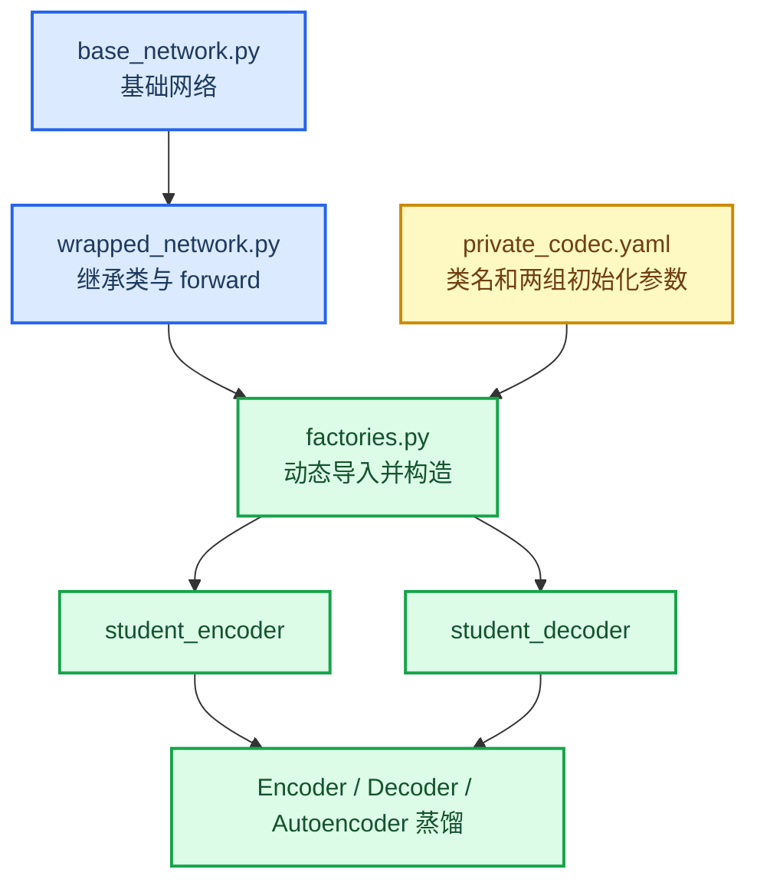

# 黑盒编解码器接入教程

_适用于两个 Python 文件组成的私有网络：一个基础网络文件，另一个继承基础网络并封装 `forward`；同一个封装类通过不同初始化参数分别构造 Encoder 和 Decoder。_

---

## 📋 你只需要填写什么

工程已经准备好目录、空源码文件、通用 factory 和三份训练配置。你只需要完成下面三件事：

1. 把基础网络源码粘贴到 `src/private_codec/base_network.py`
2. 把继承并封装 `forward` 的源码粘贴到 `src/private_codec/wrapped_network.py`
3. 在 `configs/students/private_codec.yaml` 填写封装类名和 Encoder、Decoder 各自的初始化参数

不需要修改以下文件：

```text
src/distill_codec/trainer.py
src/distill_codec/recipes.py
src/distill_codec/adapters.py
src/distill_codec/config.py
```

当前已经准备好的结构如下：

```text
DIT_DEC_ENC/
├── PRIVATE_CODEC_INTEGRATION_TUTORIAL.md
├── configs/
│   ├── local/
│   │   ├── private_codec_encoder.yaml
│   │   ├── private_codec_decoder.yaml
│   │   └── private_codec_autoencoder.yaml
│   └── students/
│       └── private_codec.yaml
└── src/
    └── private_codec/
        ├── __init__.py
        ├── base_network.py
        ├── wrapped_network.py
        └── factories.py
```

`base_network.py` 和 `wrapped_network.py` 当前是空文件，留给你直接粘贴源码。`factories.py` 已经写好，不需要填写类名或构造参数。

## 🔗 接入关系



关键点是：Encoder 和 Decoder 可以是同一个 Python 类。工程会调用两次这个类，只是分别传入两组不同的 `init_kwargs`。

## ✍️ 第一步：粘贴基础网络

打开空文件：

```text
src/private_codec/base_network.py
```

把第一个 `.py` 文件的完整内容粘贴进去。不要把它粘贴到 `distill_codec`、`third_party` 或 `factories.py`。

如果原文件依赖同目录下的其他私有文件，也把这些文件放入 `src/private_codec/`，并使用包内相对导入。例如：

```python
from .some_private_layer import SomePrivateLayer
```

## ✍️ 第二步：粘贴封装网络

打开空文件：

```text
src/private_codec/wrapped_network.py
```

把第二个 `.py` 文件的完整内容粘贴进去。这个文件应当包含最终被实例化的封装类以及它的 `forward`。

如果原代码这样导入基础网络：

```python
from base_network import BaseNetwork
```

复制进当前包后改成相对导入：

```python
from .base_network import BaseNetwork
```

假设最终封装类大致如下：

```python
class YourWrappedNetwork(BaseNetwork):
    def __init__(self, in_channels, out_channels, codec_mode, **kwargs):
        super().__init__(
            in_channels=in_channels,
            out_channels=out_channels,
            **kwargs,
        )
        self.codec_mode = codec_mode

    def forward(self, x):
        return super().forward(x)
```

这里的类名和参数只是示例。不要为了匹配示例重命名你的类，下一步直接在 YAML 中填写真实名称即可。

## ⚙️ 第三步：填写类名和两组参数

打开：

```text
configs/students/private_codec.yaml
```

原始模板如下：

```yaml
components:
  student_encoder:
    backend: external
    factory: private_codec.factories:create_encoder
    checkpoint: null
    kwargs:
      module_path: private_codec.wrapped_network
      class_name: YourWrappedNetwork
      init_kwargs: {}
    adapter:
      kind: encoder
      input_mode: packed_6ch

  student_decoder:
    backend: external
    factory: private_codec.factories:create_decoder
    checkpoint: null
    kwargs:
      module_path: private_codec.wrapped_network
      class_name: YourWrappedNetwork
      init_kwargs: {}
    adapter:
      kind: decoder
      output_mode: sparse_yuv
```

假设你的类名是 `CodecNet`，Encoder 和 Decoder 的构造参数不同，可以填写成：

```yaml
components:
  student_encoder:
    backend: external
    factory: private_codec.factories:create_encoder
    checkpoint: null
    kwargs:
      module_path: private_codec.wrapped_network
      class_name: CodecNet
      init_kwargs:
        in_channels: 6
        out_channels: 16
        codec_mode: encoder
        width: 64
    adapter:
      kind: encoder
      input_mode: packed_6ch

  student_decoder:
    backend: external
    factory: private_codec.factories:create_decoder
    checkpoint: null
    kwargs:
      module_path: private_codec.wrapped_network
      class_name: CodecNet
      init_kwargs:
        in_channels: 16
        out_channels: 3
        codec_mode: decoder
        width: 96
    adapter:
      kind: decoder
      output_mode: sparse_yuv
```

需要填写的字段：

| 字段 | 填写内容 |
| --- | --- |
| `module_path` | 通常保持 `private_codec.wrapped_network` |
| `class_name` | 第二个文件中最终封装类的真实类名 |
| `init_kwargs` | 原样传给该类 `__init__` 的参数 |
| `checkpoint` | 学生预训练 state dict 路径；从头训练时保持 `null` |
| `input_mode` | Encoder 实际需要的输入格式 |
| `output_mode` | Decoder 实际返回的颜色格式 |

`init_kwargs` 中不要填写 `self`，也不要填写只在 `forward` 中出现的输入。

## 📚 第四步：确认输入输出契约

### Encoder 输入

默认配置是：

```yaml
input_mode: packed_6ch
```

此时 Adapter 先把 RGB 转成 `Y00,Y01,Y10,Y11,U,V`，你的 Encoder 收到：

```text
[B,6,H/2,W/2]
```

如果你的 Encoder 自己接收 RGB，则改成：

```yaml
input_mode: rgb
```

此时收到：

```text
[B,3,H,W]
```

当前 Wan latent 契约要求 Encoder 返回：

```text
[B,16,H/8,W/8]
```

### Decoder 输出

默认配置是：

```yaml
output_mode: sparse_yuv
```

此时 Decoder 接收：

```text
[B,16,H/8,W/8]
```

并返回：

```text
[B,3,H,W]
```

三个通道表示 sparse YUV，U/V 只在每个 `2x2` 区域左上角位置有效，由 Adapter 上采样并转换到 RGB 后计算 loss。

如果你的 Decoder 已经直接输出 `[0,1]` 范围 RGB，则修改为：

```yaml
output_mode: rgb
```

> ⚠️ **注意：** `output_mode` 必须描述网络真实输出，不能只因为模板默认写了 `sparse_yuv` 就保留该值。

## 📍 第五步：选择训练配置

工程已经准备了三份主配置。

| 目标 | 配置文件 | Recipe |
| --- | --- | --- |
| 只训练 Encoder | `configs/local/private_codec_encoder.yaml` | `wan_encoder_distill` |
| 只训练 Decoder | `configs/local/private_codec_decoder.yaml` | `wan_decoder_distill` |
| Encoder 和 Decoder 联合训练 | `configs/local/private_codec_autoencoder.yaml` | `wan_autoencoder_distill` |

三份配置都引用：

```yaml
includes:
  - ../teachers/wan_snapshot.yaml
  - ../students/private_codec.yaml
```

训练前至少检查下面的路径：

```yaml
data:
  lq_root: ~/dit_codec/LQ
  gt_root: ~/dit_codec/GT

run:
  output_dir: ~/dit_codec/runs/private_codec_autoencoder
```

教师权重路径位于：

```text
configs/teachers/wan_snapshot.yaml
```

默认需要：

```text
~/dit_codec/weights/Wan2.1_VAE.pth
```

## ✅ 第六步：验证能否导入

先安装当前工程：

```bash
python -m pip install -e .
```

验证封装模块可以导入：

```bash
python -c "import private_codec.wrapped_network as m; print(m.__file__)"
```

验证 Encoder factory。将 `CodecNet` 和参数替换为你的实际值：

```bash
python -c "from private_codec.factories import create_encoder; print(create_encoder(class_name='CodecNet', init_kwargs={'in_channels': 6, 'out_channels': 16, 'codec_mode': 'encoder'}))"
```

验证 Decoder factory：

```bash
python -c "from private_codec.factories import create_decoder; print(create_decoder(class_name='CodecNet', init_kwargs={'in_channels': 16, 'out_channels': 3, 'codec_mode': 'decoder'}))"
```

如果类名错误，会看到类似错误：

```text
ValueError: cannot find class 'CodecNet' in module 'private_codec.wrapped_network'
```

如果构造参数错误，Python 会直接报告缺少参数或出现未知参数。根据错误修改 `init_kwargs`，不要修改 `factories.py`。

## ✅ 第七步：运行 probe

只检查 Encoder：

```bash
python -m distill_codec.cli probe \
  --config configs/local/private_codec_encoder.yaml
```

只检查 Decoder：

```bash
python -m distill_codec.cli probe \
  --config configs/local/private_codec_decoder.yaml
```

检查联合链路：

```bash
python -m distill_codec.cli probe \
  --config configs/local/private_codec_autoencoder.yaml
```

`probe` 会真实构造教师和学生网络，并执行一次完整 forward。通过时会输出 JSON，其中包含 loss、参数量和输出图像 shape。

常见 shape 错误及检查位置：

| 错误 | 检查位置 |
| --- | --- |
| Encoder 输入通道错误 | `input_mode` 是否应为 `rgb` 或 `packed_6ch` |
| Encoder latent 通道错误 | Encoder 初始化参数及 `out_channels` |
| Encoder latent 尺寸错误 | 网络下采样倍率是否为 `8` |
| Decoder 输入通道错误 | Decoder 初始化参数是否接收 `16` 通道 latent |
| Decoder 输出颜色异常 | `output_mode` 是否正确 |
| 找不到基础网络 | `wrapped_network.py` 是否使用 `.base_network` 相对导入 |

## 🚀 第八步：启动训练

只训练 Encoder：

```bash
python -m distill_codec.cli train \
  --config configs/local/private_codec_encoder.yaml
```

只训练 Decoder：

```bash
python -m distill_codec.cli train \
  --config configs/local/private_codec_decoder.yaml
```

联合训练：

```bash
python -m distill_codec.cli train \
  --config configs/local/private_codec_autoencoder.yaml
```

恢复训练：

```bash
python -m distill_codec.cli train \
  --config configs/local/private_codec_autoencoder.yaml \
  --resume ~/dit_codec/runs/private_codec_autoencoder/checkpoints/step_XXXXXXXX.pt
```

## ⚠️ 训练前检查清单

- [ ] 基础网络已粘贴到 `src/private_codec/base_network.py`
- [ ] 封装网络已粘贴到 `src/private_codec/wrapped_network.py`
- [ ] 封装文件使用正确的包内相对导入
- [ ] `class_name` 与真实类名完全一致，包括大小写
- [ ] Encoder 和 Decoder 使用各自真实的 `init_kwargs`
- [ ] `input_mode` 与 Encoder 实际输入一致
- [ ] `output_mode` 与 Decoder 实际输出一致
- [ ] 学生 `forward` 没有整体包在 `torch.no_grad()` 中
- [ ] 学生输出没有在 loss 之前调用 `.detach()` 或转成 NumPy
- [ ] 数据目录和 Wan 教师权重路径存在
- [ ] 三个 `probe` 中至少运行了与你训练目标对应的一个

## 🔗 相关文件

- [主 README](README.md)
- [FlashVSR 蒸馏教程](FLASHVSR_DISTILL_TUTORIAL.md)
- [新增 Backend 说明](docs/ADDING_A_BACKEND.md)
