# Paired Geometric Augmentation Design

_Linux FlashVSR distillation data pipeline extension, 2026-08-19_

---

## 📋 Goal

Add configurable paired geometric augmentation for LQ/GT image training:

- Images smaller than configured `lq_size` or `gt_size` fail during dataset preflight.
- Images exactly equal to the configured size pass through without cropping.
- Larger images are cropped to the configured size.
- LQ and GT in each pair must have the same original height and width.
- LQ and GT always receive the same crop, rotation, and translation.
- One training batch shares one augmentation parameter set.
- Validation and `probe` are deterministic: center crop only, without random rotation or translation.
- Existing behavior remains available when augmentation is disabled.

This feature targets paired FlashVSR `LQ_proj_in` and conditional `TCDecoder` distillation. It does not add image resizing or aspect-ratio distortion.

## ⚙️ Configuration

```yaml
data:
  lq_root: ~/dit_codec/LQ
  gt_root: ~/dit_codec/GT
  lq_size: [256, 256]
  gt_size: [256, 256]

  augmentation:
    enabled: true
    shared_across_batch: true

    crop:
      enabled: true
      mode: random

    rotation:
      enabled: true
      mode: continuous
      probability: 0.3
      degrees: [-5.0, 5.0]
      interpolation: bilinear
      padding_mode: reflection

    translation:
      enabled: true
      probability: 0.3
      max_fraction: [0.05, 0.05]
      padding_mode: reflection
```

Supported values:

| Field | Supported values | Meaning |
| --- | --- | --- |
| `augmentation.enabled` | Boolean | Master switch |
| `shared_across_batch` | `true` in v1 | One parameter set per batch |
| `crop.enabled` | Boolean | Enable target-size cropping |
| `crop.mode` | `random` | Random train crop; validation/probe still use center crop |
| `rotation.mode` | `continuous`, `right_angle` | Continuous range or 90-degree multiples |
| `rotation.probability` | `[0,1]` | Probability of applying rotation |
| `rotation.degrees` | Two numbers | Inclusive continuous angle range in degrees |
| `rotation.interpolation` | `bilinear`, `nearest` | Sampling mode for rotation and translation |
| `rotation.padding_mode` | `reflection`, `border`, `zeros` | Out-of-image sampling behavior |
| `translation.probability` | `[0,1]` | Probability of applying translation |
| `translation.max_fraction` | Two values in `[0,1)` | Maximum vertical and horizontal shift as target-size fractions |
| `translation.padding_mode` | Same as rotation | Must equal rotation padding mode when both are enabled |

For v1, `shared_across_batch: false` is rejected with a clear configuration error. The field is retained so per-sample sampling can be added later without changing the YAML shape.

## 🔄 Data flow

```mermaid
flowchart LR
    accTitle: Paired Augmentation Data Flow
    accDescr: Raw paired images are checked, cropped with one batch-shared normalized position, stacked, moved to the training device, and transformed with one shared affine matrix.

    load_pairs(["Load paired RGB images"]) --> validate_pair["Check equal pair size"]
    validate_pair --> validate_min["Check minimum target size"]
    validate_min --> sample_crop["Sample shared crop position"]
    sample_crop --> crop_pairs["Crop each LQ and GT pair"]
    crop_pairs --> stack_batch["Stack fixed-size batch"]
    stack_batch --> move_device["Move batch to device"]
    move_device --> affine["Apply shared rotation and translation"]
    affine --> recipe(["Run teacher and student"])

    classDef process fill:#dbeafe,stroke:#2563eb,stroke-width:2px,color:#1e3a5f
    classDef success fill:#dcfce7,stroke:#16a34a,stroke-width:2px,color:#14532d

    class validate_pair,validate_min,sample_crop,crop_pairs,stack_batch,move_device,affine process
    class recipe success
```



### Raw batch boundary

The current dataset immediately stacks samples, which cannot support differently sized source images before cropping. The new data boundary will be:

1. `PairedImageDataset` returns decoded, unstacked LQ/GT tensors plus relative path.
2. A raw-batch collator returns a list-like `RawPairedBatch` without stacking.
3. The trainer converts `RawPairedBatch` into the existing `DistillBatch` immediately before recipe execution.
4. Existing public `collate_distill_batch` remains available for callers that already have equal-sized tensors.

This keeps recipe and model interfaces unchanged.

## ✂️ Crop semantics

`lq_size` and `gt_size` retain `[height, width]` ordering.

When paired augmentation and crop are enabled:

- `lq_size` must equal `gt_size` because the selected design assumes same-resolution LQ/GT pairs.
- Each LQ/GT pair must have identical original dimensions.
- Each source dimension must be greater than or equal to the target dimension.
- A smaller source dimension raises `ContractError` during preflight and names the relative file.
- Equal-sized inputs use top-left `(0, 0)` because no crop is needed.
- Larger inputs use a random crop during training and a center crop during validation/probe.

One pair uses exactly the same integer crop coordinates for LQ and GT.

For a batch whose source images have different dimensions, the batch shares normalized crop offsets `(u, v)` in `[0,1]`. Each pair maps these offsets to its own valid integer top-left range:

```text
top  = round(u * (source_height - target_height))
left = round(v * (source_width  - target_width))
```

Therefore the batch shares the same relative crop location. If all source images have the same dimensions, they also share identical pixel coordinates.

When augmentation or crop is disabled, current strict-size behavior is preserved: source dimensions must exactly equal `lq_size` and `gt_size`.

## 🔄 Rotation and translation

Rotation and translation run after cropping and stacking, on the trainer device. One affine matrix is expanded across the batch, so all samples and both LQ/GT tensors receive the same transformation.

Continuous rotation samples one angle from `degrees`. The recommended default is `[-5.0, 5.0]` with probability `0.3`.

Translation samples vertical and horizontal fractions independently from symmetric ranges:

```text
vertical   in [-max_fraction[0], +max_fraction[0]]
horizontal in [-max_fraction[1], +max_fraction[1]]
```

At `256x256` and `0.05`, the maximum magnitude is approximately 13 pixels per axis.

The implementation uses PyTorch `affine_grid` and `grid_sample`; no torchvision dependency is added. LQ and GT use the same interpolation and padding behavior to preserve alignment. Reflection padding is the documented default.

`right_angle` mode samples from `0`, `90`, `180`, and `270` degrees. It uses tensor rotations without interpolation. Translation may still be applied afterward when enabled.

## 🎲 Determinism and resume

Augmentation randomness must not depend on DataLoader worker scheduling or global Python RNG.

The trainer derives a local deterministic generator seed from:

- `run.seed`
- training phase
- optimizer `global_step`
- gradient-accumulation `micro_step`

This makes augmentation parameters reproducible for a given batch position. Existing sampler replay restores the same data order after resume, and the step-derived augmentation seed restores the same crop/affine parameters without adding mutable augmentation RNG state to checkpoints.

The full `data.augmentation` mapping becomes part of the checkpoint training contract. Resume rejects augmentation configuration changes. `num_workers` does not affect sampled augmentation parameters.

## 🧪 Train, validation, and probe behavior

| Phase | Crop | Rotation | Translation |
| --- | --- | --- | --- |
| Training | Random, batch-shared normalized position | Random by probability | Random by probability |
| Validation | Center | Disabled | Disabled |
| CLI `probe` | Center | Disabled | Disabled |

This prevents validation metrics and probe output from changing between identical runs.

The preflight report continues to describe original on-disk dimensions. Probe output images and recipe inputs have configured target dimensions after center cropping.

## 🔒 Compatibility boundaries

The first version supports standard paired-image recipes whose latent is produced online by a teacher encoder, including the documented FlashVSR workflow.

Geometric augmentation is rejected when `latent_provider.type` is `cached` or `dataset`, because a cached latent would need an exactly corresponding spatial crop and affine transform. Silent image/latent misalignment is not allowed.

The feature does not change color conversion, encoder/decoder adapters, teacher preprocessing, recipe losses, or checkpoint payload student state.

## ❌ Validation and errors

Configuration preflight rejects:

- missing `lq_size` or `gt_size` while crop is enabled
- different `lq_size` and `gt_size`
- `shared_across_batch: false` in v1
- probabilities outside `[0,1]`
- malformed or descending degree ranges
- negative or `>=1` translation fractions
- unsupported interpolation or padding values
- conflicting padding modes while rotation and translation are both enabled
- paired augmentation with cached or dataset latent providers

Dataset preflight rejects:

- unequal original dimensions within an LQ/GT pair
- any source dimension smaller than the configured target
- invalid or undecodable images, as before

Error messages include the relative image path and actual/required dimensions where applicable.

## 🧪 Test strategy

Unit tests will cover:

- smaller images fail during preflight
- exact-size images pass through unchanged
- larger images crop to target size
- LQ and GT use identical crop and affine parameters
- batch members share normalized crop, angle, and translation parameters
- different source dimensions can coexist in a batch after normalized-position cropping
- continuous rotation and translation preserve final shape
- disabled augmentation preserves strict legacy behavior
- validation and probe use deterministic center crop without affine changes
- fixed seed and step reproduce identical outputs
- different steps produce different train augmentation parameters
- resume matches uninterrupted training with augmentation enabled
- cached/dataset latent providers are rejected
- YAML parsing and configuration validation errors are explicit

Integration tests will run a mock training recipe with oversized paired images, save a checkpoint, resume, and compare the result with uninterrupted training.

## 📚 Documentation changes

Update both `README.md` and `FLASHVSR_DISTILL_TUTORIAL.md` to explain:

- `lq_size` and `gt_size` become crop output sizes only when crop augmentation is enabled
- smaller inputs fail and larger inputs random-crop
- validation/probe center-crop deterministically
- all augmentation YAML fields and supported values
- paired alignment and batch-sharing semantics
- resume restrictions
- cached latent limitation

The tutorial examples will enable crop, continuous `±5°` rotation, and `5%` translation with probability `0.3`.

## 🚫 Non-goals

- automatic image resizing or aspect-ratio correction
- perspective, shear, elastic, color, blur, or noise augmentation
- per-sample augmentation in v1
- augmentation of cached latent tensors
- changing FlashVSR teacher architecture or student interfaces
- claiming that the default probabilities or ranges are optimal for every dataset
